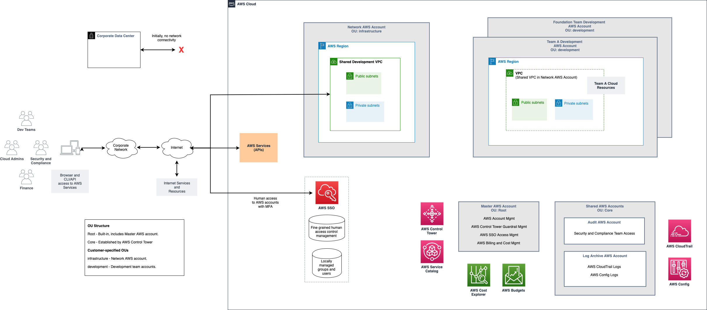

# Initial Development Environment Solution Overview

The following diagram represents a typical team development environment as a distinct AWS account supported by an initial set of foundation capabilities managed via a set of shared AWS accounts to meet the typical requirements outlined above. 

Since your specific requirements may include some of the optional [Fast Follow-On Requirements](../2-fast-follow-on/1-1-requirements.md), aspects of your initial solution may be different than shown in this diagram.

Key aspects of the initial, minimal solution include:

## Initial Users of Your AWS Environment

The initial development team, your designated cloud administrators, security and compliance team members, and potentially your finance team members who are concerned with cloud spend, will typically use their corporate desktops to access the AWS Management Console and AWS service APIs over the Internet. Technical users will typically install the AWS Command Line Interface (CLI) and related Software Development Kits (SDKs) on their local corporate desktops to ease the process of interacting with your AWS environment.

## Team Development AWS Accounts

Each development team is allocated a distinct AWS account to act as a resource container for the AWS resources a team creates and manages on its own.  Since AWS service costs are automatically reported for each AWS account, using a distinct AWS account for each team’s development needs is a convenient way to make costs visible and attributable to each team.

In addition to your initial application and data engineering development teams that need access to the AWS platform, you should view your initial cloud platform engineers and administrators as a development team in its own right that should have its own AWS account for its own work to iterate on, develop, and perform early testing of changes to the foundation and experimentation with new data and application services.

Each development team account has an AWS Virtual Private Cloud (VPC) network to support cases in which a team needs to deploy AWS resources that reside in VPCs. For example, deploying Amazon EC2 Virtual Machines (VMs) and Amazon Relational Database Service (RDS) instances. These VPCs provide both public and private subnets across multiple Availability Zones (AZs) to both mimic typical production topologies and enable teams to access Internet-based resources such as package repositories and publicly available APIs during their experiment and development work.

## Direct Internet Access

In this initial stage of your foundation, your users’ existing access to the Internet via the corporate network is used both to enable all users to access the AWS platform and to enable developers to access their workloads and data services hosted in their AWS development accounts.

In this initial stage, there’s no network connectivity between your AWS accounts and your on-premises data center.

## AWS Single Sign-On (SSO)

AWS SSO is used to initially manage the initial relatively limited number of human users across your development teams and cloud administrators who need to access the AWS Management Console and AWS APIs to get things done in either team development accounts or in support of managing and operating the overall use of AWS. Initially, you’ll use a locally managed store of groups and users in AWS to represent people who can access your AWS accounts.

As a best practice, it’s strongly recommended that all users managed via AWS SSO set up MFA for their login accounts.

AWS SSO includes the ability to manage permission sets that define which groups of users can access which AWS accounts and the fine grained AWS Identity and Access Management (IAM) permissions associated with this access.  AWS SSO automatically propagates these permissions to each member AWS account in your AWS organization.

## Shared AWS Accounts

Once you’ve signed up for a new AWS account, the “master” account, your cloud administrators will use AWS Control Tower via the Master AWS account to establish a “landing zone” of conventional shared AWS accounts and resources to help provide an initial foundation for your use of AWS. 

Your Master AWS account will be the place in which your cloud administrators will use AWS Control Tower’s [Account Factory](https://docs.aws.amazon.com/controltower/latest/userguide/account-factory.html) via AWS Service Catalog to create new team development accounts, AWS SSO to create and manage groups and users in the locally managed directory, and generally monitor the overall use and health of your AWS environment.

You can grant access to members of your Security and Compliance teams access to the Audit AWS account so that they can easily get into any of the other accounts to review usage and investigate issues.

AWS Control Tower sets up a Log Archive account to secure store AWS platform-wide logs such as AWS CloudTrail logs that record access to all AWS APIs across your accounts and AWS Config logs that record all changes to AWS resources across your accounts.

## Standard AWS Control Tower Guardrails

By using AWS Control Tower, your organization automatically benefits from the set of [built-in guardrails](https://docs.aws.amazon.com/controltower/latest/userguide/guardrails.html) that represent common preventative and detective security controls. AWS Control Tower includes mandatory, strongly recommended, and elective guardrails.

## Next Steps

[1. Map People to Foundation Functional Roles](2-1-map-people-to-foundation-roles.md)
