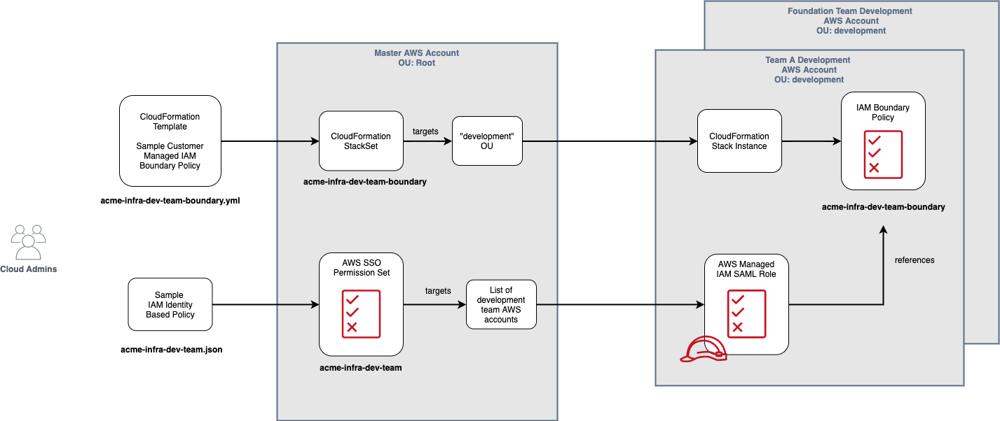

# Controlling Development Team Access

The sample IAM policies described in this document are intended to be used as a starting point for how you might control development team access in development team AWS accounts so that development teams have the freedom to get many things done on their own yet be constrained from adversely impacting the security and stability of development team AWS accounts.

Your organization is expected to understand these sample policies in detail before potentially applying them.  

As you progress on your journey, managing and controlling changes to these types of policies will be a critical responsibility of your foundation team.  Typically, only your Cloud Security team would have access to create and update such policies.

* [Goals](#goals)
* [Requirements](#requirements)
* [Common Scenarios](#common-scenarios)
* [Sample Implementation](#sample-implementation)
  * [Overview of the Implementation](#overview-of-the-implementation)
  * [Base Policy Walkthrough](#base-policy-walkthrough)
  * [Permissions Boundary Walkthrough](#permissions-boundary-walkthrough)

## Goals

The overall intent of the policies is to enable your technologists to have broad freedom to innovate, experiment, develop, and perform early testing in their development team AWS accounts while being prevented from adversely impacting the overall security and the stability of the underlying foundation of those AWS accounts.

These policies are not intended to be applied beyond development AWS accounts.  For example, it's a best practice for organizations to apply strict policies for the creation and management of cloud resources in formal test and production environments and the associated AWS accounts.

## Requirements

The following requirements are intended to provide a practical sense of the access that you may consider providing to development teams.

### Disallow Access

**Disallow Modification of Foundation Resources:** For example:
* AWS Control Tower CloudFormation StackSet stack instances.
* Foundation IAM roles and policies.

**Disallow Creation of Sensitive IAM Resources:**  For example:
* IAM Users: Given the use of AWS SSO for human user login, there's generally no need for IAM users.
* SAML Providers: Creation of these resources could enable external entities to access your AWS account.

**Disallow Privilege Escalation:** Inhibit development team members from creating and using IAM roles that circumvent these requirements.

**Disallow Creation and Management of VPC Resources:** Since development teams already have read only access to a shared development VPC and supporting network resources, teams should not generally need to create and manage VPC resources. 

### Allow Access

**Allow Wide Range of AWS Services Subject to Organizational Policies:**  Allow for use of any AWS service with the expectation that AWS Organizations Service Control Policies (SCP) will be used to restrict the overall set of AWS services that are accessible for any AWS account in the "development" organization.

**Allow Creation of IAM Roles and Policies:** In development environments your technologists should be able to experiment, develop, and test solutions without depending on other teams to get things done. Since this work often entails creation of wokrkload specific IAM roles and policies, your technologists should be able to create and manage roles and policies on their own subject to the constraint that development team members must not be able to escalate their privileges to circumvent other policies. For example, it's a common need to be able to define custom IAM roles and policies and attach the roles to Amazon EC2 instances and Lambda functions.

**Allow Read Only Access to IAM Roles and Policies:** Allow developers to browse and review IAM resources.

### User Experience

**Avoid Prematurely Requiring Standard Resource Naming and Tagging:** Although your organization will find value in the introduction of cloud resource naming and tagging standards in support of a variety of needs, these standards are not necessary to impose sufficient constraints on development teams at this early stage in your journey.

However, it is important that foundation resources adhere to a naming convention so that IAM policies can be defined to inhibit unauthorized modification of those resources.

### Assumptions

**Consider Separate Policy for Foundation Team Development:** Since your cloud foundation team members will likely need additional acccess in their foundation team development AWS account, a derivative of this sample policy may be warranted.  As a best practice, when foundation team members are doing day-to-day development of Infrastructure as Code (IaC), they should not be using administrative access roles and permissions.  Instead, they should drop into the Cloud Administrator and similar roles only when they need to perform their administrative duties.

## Common Scenarios

There are two common scenarios that the access requirements are intended to address:

* Developers working directly with AWS services.
* Developers creating customer managed IAM roles and policies.

### Developers Working Directly with AWS Services

When your technologists experiment and formally develop with AWS services, the IAM role under which they work in their development team AWS account needs access to a variety of AWS services.

### Developers Creating Customer Managed IAM Roles and Policies

When developers are formally building out working configurations of AWS services, they often need to define and configure customer managed IAM roles and policies that are specific to their workloads. Once the workload specific IAM roles and policies are created, they are associated with AWS services so that those services can operate with the appropriate permissions.  This work to development and initially test workload specific IAM roles and policies is best performed by the development teams that are also developing the workloads.

Typically, before workload specific IAM roles and policies are used in more strictly controlled test and production environments and associated AWS accounts, customers implement human powered workflows and, in more advanced cases, highly automated code pipelines to review and test workload specific IAM roles and policies.

#### Creating Customer Managed IAM Roles

When experimenting, developing, and testing workload specific IAM roles and policies, developers use a variety of tools including:

* AWS Management Console.
* AWS CLI or SDKs.
* AWS CloudFormation or other Infrastucture as Code (IaC) tools such as Terraform.

The IaC tools are typically used before workload specific IAM roles and policies are promoted to test and production environments.

#### Using Customer Managed IAM Roles

The following scenarios are just a few examples of when a development team would associate a customer managed IAM role with an AWS service:

* Deploy EC2 instance and associate an instance profile.
* Deploy a Lambda function.
* Deploy a Cloud9 IDE workspace.
* Deploy a Redshift cluster to support data warehousing use cases.
* Deploy containers to Amazon ECS and EKS container orchestration services.

## Sample Implementation

This section provides an overview of the sample policies and then walks through each set of policies in detail.

### Overview of the Implementation

In support of the requirements described above, two sets of IAM policies are used:

|Policy|Purpose|Usage|Sample Code|
|------|-------|-----|-----------|
|**Development Team IAM Policy**|A JSON format IAM policy used for control human user access to development AWS accounts.|This policy is used to create a custom permission set in AWS SSO that is associated with development team groups and development team AWS accounts.|[acme-infra-dev-team.json](../4-code-samples/01-iam-policies/acme-infra-dev-team.json)|
|**Development Team IAM Permissions Boundary**|An IAM customer managed permissions boundary policy that is used to control permissions of IAM roles created by development team users in their development team AWS accounts.|This AWS CloudFormation template forms the basis of a CloudFormation StackSet that is applied to all development team AWS accounts.|[acme-infra-dev-team-boundary.yml](../4-code-samples/01-iam-policies/acme-infra-dev-team-boundary.yml)|

#### Provisioning the Policies



#### Using the Policies

AWS IAM Permissions Boundaries is a feature that enables delegation of permissions management to trusted employees, but with the ability to constrain the overall scope of their access.  In this scenario, we're delegating a degree of permissions management to development team members in their development AWS accounts so tha

### Base Policy Walkthrough

[acme-infra-dev-team.json](../4-code-samples/01-iam-policies/acme-infra-dev-team.json)

Each section of the sample policy is explained here.

### Allow Virtually All AWS Services

Start by allowing access to all AWS service resources and actions.  

As mentioned above, it's a best practice to use AWS Organizations SCPs to provide an overarching constraint on which AWS services can be used in a given AWS ccount. Instead of over complicating the following policy with fine grained lists of allowed or disallowed AWS services, it's best practice to defer to SCPs.

```
        {
            "Effect": "Allow",
            "Action": "*",
            "Resource": "*"
        },
```
### Disallow Key IAM, Account, and Billing Write Access

Explicitly disallow creation of IAM users since development team users do not use IAM users to access their development AWS accounts.

```
        {
            "Sid": "DenyUnnecessaryIam",
            "Effect": "Deny",
            "Action": [
                "iam:CreateUser",
                "iam:CreateGroup",
                "iam:CreateSAMLProvider",
                "iam:DeleteSAMLProvider",
                "iam:UpdateSAMLProvider",
                "iam:DeleteAccountPasswordPolicy",
                "iam:UpdateAccountPasswordPolicy",
                "iam:DeleteUserPermissionsBoundary",
                "iam:DeleteRolePermissionsBoundary"
            ],
            "Resource": "*"
        },
        {
            "Sid": "DenyWriteBillingAccount",
            "Effect": "Deny",
            "Action": [
                "aws-portal:ModifyAccount",
                "aws-portal:ModifyBilling",
                "aws-portal:ModifyPaymentMethods",
                "account:*"
            ],
            "Resource": "*"
        },
```

### Allow Listing of AWS Regions

```
        {
            "Effect": "Allow",
            "Action": "account:ListRegions",
            "Resource": "*"
        },
```

### Deny Creation of IAM Roles When Permissions Boundary is Not Attached

Disallow developers creating new IAM roles unless the permissions boundary policy is attached at role creation time.

```
        {
            "Sid": "DenyWriteRoles",
            "Effect": "Deny",
            "Action": [
                "iam:CreateRole",
                "iam:AttachRolePolicy",
                "iam:DetachRolePolicy"
            ],
            "Resource": "*",
            "Condition": {
                "StringNotLike": {
                    "iam:PermissionsBoundary": "arn:aws:iam::*:policy/acme-infra-dev-team-boundary"
                }
            }
        },
```

### Allow Creation of IAM Roles Only When Permissions Boundary is Attached

Allow development team members to create IAM roles as long as the permissions boundary policy is attached at role creation time.

```
        {
            "Sid": "AllowWriteRolesWithBoundary",
            "Effect": "Allow",
            "Action": [
                "iam:CreateRole",
                "iam:AttachRolePolicy",
                "iam:DetachRolePolicy"
            ],
            "Resource": "*",
            "Condition": {
                "StringLike": {
                    "iam:PermissionsBoundary": "arn:aws:iam::*:policy/acme-infra-dev-team-boundary"
                }
            }
        },
```

#### Deny Modification of Foundation Resources

Do not allow development team members to disrupt the foundation resources.

**Foundation IAM Roles and Policies**

Note the use of a naming convention for customer-managed roles and policies below.  The sample naming convention shown below is simply `<org identifier>-infra-...` where `infra` is shorthand for "foundation".

Since IAM resources named with `AWS` and `aws` are not inherently modifiable by customers, they are not included in the following section.

```
        {
            "Sid": "DenyWriteAccessFoundationRoles",
            "Effect": "Deny",
            "Action": [
                "iam:CreateRole",
                "iam:DeleteRole",
                "iam:UpdateRole"
            ],
            "Resource": [
                "arn:aws:iam::*:role/acme-infra-*"
            ]
        },
        {
            "Sid": "DenyWriteAccessFoundationPolicies",
            "Effect": "Deny",
            "Action": [
                "iam:CreatePolicy",
                "iam:DeletePolicy",
                "iam:DeletePolicyVersion"
            ],
            "Resource": "arn:aws:iam::*:policy/acme-infra-*"
        },
```

**AWS ControlTower CloudFormation StackSet Stacks**

Since the AWS Control Tower services uses the AWS CloudFormation StackSet feature to configure resources in each AWS account that is managed by AWS Control Tower, we need to ensure that development teams cannot modify these foundation resources,

```
        {
            "Sid": "DenyWriteAccessStackSets",
            "Effect": "Deny",
            "Action": [
                "cloudformation:DeleteStack",
                "cloudformation:UpdateStack"
            ],
            "Resource": "arn:aws:cloudformation::*:stack/StackSet-*"
        },
```

#### Deny Creation and Management of VPC Resources

Since a centrally managed VPC is shared with development AWS accounts in a read only manner and it's a best practice to delegate ownership and management of VPC resources to your central foundation team, typically, development teams don't need to have write access to VPC resources.

Note that both EC2 VM related resources and VPC related networking resources share the same IAM `ec2:` namespace. In their development AWS accounts, development teams are allowed to create EC2 VM related resources.

```
        {
            "Sid": "DenyVPCWrite",
            "Effect": "Deny",
            "Action": [
                "ec2:CreateCustomerGateway",
                "ec2:CreateDefaultSubnet",
                "ec2:CreateDefaultVpc",
                "ec2:CreateDhcpOptions",
                "ec2:CreateEgressOnlyInternetGateway",
                "ec2:CreateFlowLogs",
                "ec2:CreateInternetGateway",
                "ec2:CreateNatGateway",
                "ec2:CreateNetworkAcl",
                "ec2:CreateNetworkAclEntry",
                "ec2:CreateRoute",
                "ec2:CreateRouteTable",
                "ec2:CreateSubnet",
                "ec2:CreateVpc",
                "ec2:CreateVpcEndpoint",
                "ec2:CreateVpcEndpointConnectionNotification",
                "ec2:CreateVpcEndpointServiceConfiguration",
                "ec2:CreateVpnConnection",
                "ec2:CreateVpnConnectionRoute",
                "ec2:CreateVpnGateway",
                "ec2:EnableVgwRoutePropagation",
                "ec2:EnableVpcClassicLinkDnsSupport",
                "ec2:MoveAddressToVpc",
                "ec2:RejectVpcEndpointConnections",
                "ec2:RestoreAddressToClassic",
                "ec2:AcceptVpcPeeringConnection",
                "ec2:AttachClassicLinkVpc",
                "ec2:CreateVpcPeeringConnection",
                "ec2:EnableVpcClassicLink",
                "ec2:RejectVpcPeeringConnection",
                "directconnect:*"
            ],
            "Resource": "*"
        }
```
### Permissions Boundary Walkthrough

[acme-infra-dev-team-boundary.yml](../4-code-samples/01-iam-policies/acme-infra-dev-team-boundary.yml)

Since the overall intent in this development environment scenario is to enable AWS services acting on behalf of the developers to have similar access permissions as the developers themselves, the permissions boundary policy looks very similar to the development team policy described above.  

The main difference is that creation of IAM roles and policies is disallowed in the sample permissions boundary policy. Since there was no requirement to enable AWS services to create roles and policies on behalf of developmemt team members, disallowing role creation inhibits development team members from creating roles that could circumvent the policies.

```
            {
              "Sid": "DenyWriteRoles",
              "Effect": "Deny",
              "Action": [
                "iam:CreateRole",
                "iam:DeleteRole",
                "iam:UpdateRole",
                "iam:AttachRolePolicy",
                "iam:DetachRolePolicy"
              ],
              "Resource": "*"
            },
            {
              "Sid": "DenyWritePolicies",
              "Effect": "Deny",
              "Action": [
                "iam:CreatePolicy",
                "iam:DeletePolicy",
                "iam:DeletePolicyVersion"
              ],
              "Resource": "*"
            },
```
