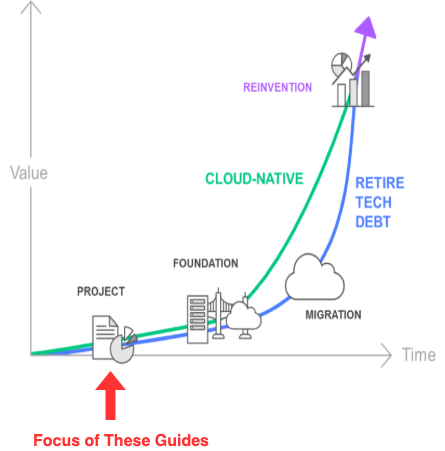
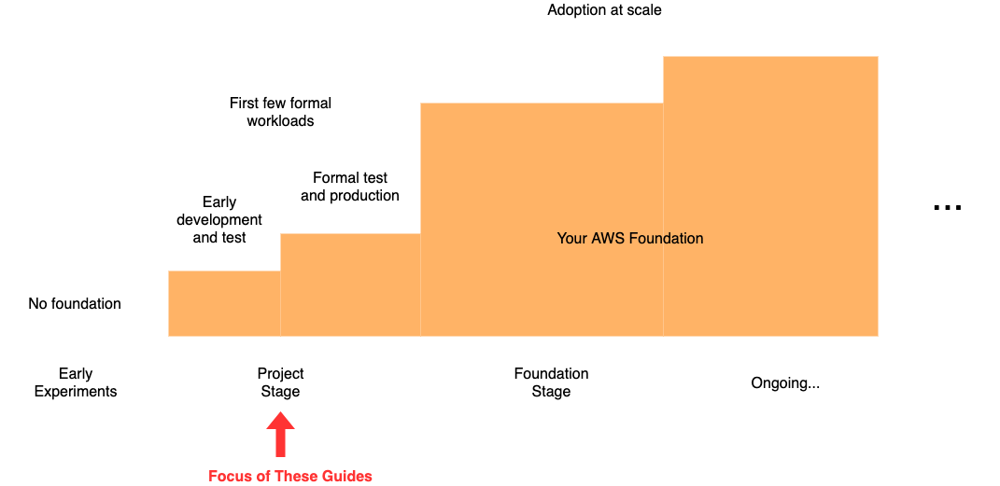

# Get Started with AWS for Formal Projects

---
***DRAFT CONTENT***

Content in this repository is in a preliminary draft form and should not be used for formal build outs of AWS environments unless an AWS specialist is working with you.  

The documentation is currently undergoing rapid changes as it is reviewed and tested. If you'd like to contribute via feedback, bug fixes, and/or enhancements, see [CONTRIBUTING](CONTRIBUTING.md).

---

Some Amazon Web Services (AWS) customers have expressed the need to have a perscriptive guide to help their organizations better understand how they can get started with the AWS platform when they are ready to move from the informal stage of using personal AWS accounts to the next stage of formally bringing a few workloads to production on AWS.

At this early stage of cloud adootion, your organization may be motivated to use AWS in support of migrating existing on-premises applications, delivering new data services, and/or developing new applications. 

# Intended Audience

Regardless of your organization's motivation for adopting AWS, these guides are intended be used by your organization's technology team that will be responsible for establishing and maintaining your inital AWS environment.

Although these guides are intended to help organizations establish an initial formal foundation on their own, you may benefit from working with your AWS sales team and AWS partners to help you navigate through this early stage of adoption.

# Stages of Cloud Adoption

Based on years of experience in helping customers obtain business benefits of cloud adoption, AWS has identified the following mental model to represent the [stages of cloud adoption](https://aws.amazon.com/blogs/enterprise-strategy/the-journey-toward-cloud-first-the-stages-of-adoption/).  

Organizations leveraging these guides are typically in the “Project” stage of adoption during which they are starting with a relatively small set of people and a few projects to begin to understand how they can leverage the cloud to meet a business need.

Once an enterprise has gained some benefit from the cloud by taking a few projects to production, an organization tends to move toward a "Foundation" stage in which the organization makes more extensive investments in boths its people and its cloud foundation in support of scaling cloud adoption across the organization with the goal of gaining more extensive business benefits. 

# Initial Cloud Foundation in Project Stage

Even in the initial project stage of adoption, AWS recommends that an initial foundation be established that can be extended over time as organizations transition into the foundation stage to prepare for larger scale cloud adoption. These guides help organizations establish the beginning of a secure foundation on AWS in support of their initial few projects.

These guides start with establishing an initial foundation and several development environments before they address how to extend your foundation to support deploying your first few workloads to test and production environments.  

The guides also address a set of "fast follow-on" capabilities that, for some organizations, are required before your organization performs formal experiments and development in the cloud. At a minimum, the fast follow-on capabilities are typicall required before you deploy your first workloads to production.

Later, after your organization has demonstrated success with the initial few projects, you will likely make larger investments during the foundation stage of your journey to support cloud adoption at scale.

# Guides

|     |     |     |
|:---:|:---:|:---:|
| **[Establish Initial Foundation and Development Environments](1-dev-environments/README.md)**| **[Establish Fast Follow-On Capabilities](2-fast-follow-on/README.md)**| **[Expand Foundation and Establish Test and Production Environments](3-test-production/README.md)**|

# Project Tenets and FAQs

* [Project Tenets](0-common/1-tenets.md)
* [Frequently Asked Questions (FAQs)](0-common/2-faq.md)
